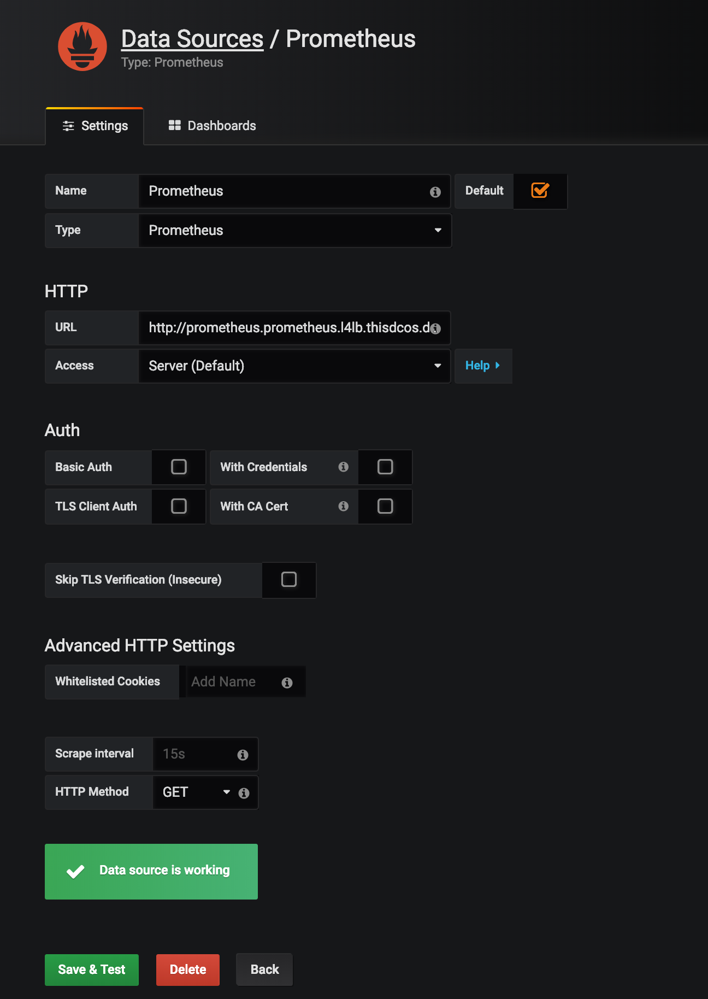
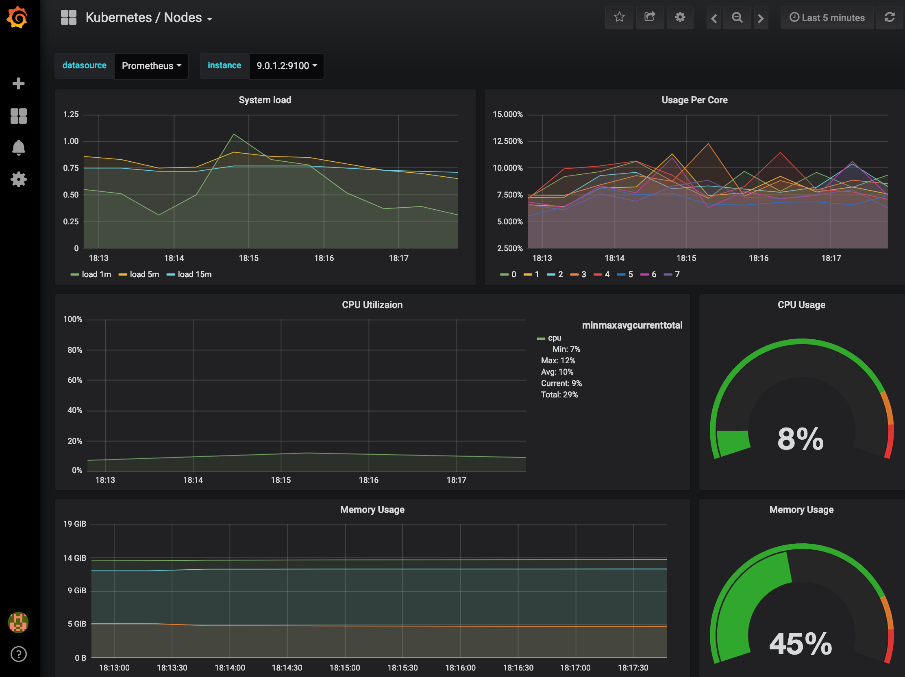

# Kubernetes - Monitoring with Prometheus Federation

This is a guide to setup and configure Prometheus Federation/Alert Manager and Grafana Dashboards to monitor a Kubernetes cluster with Mesosphere DC/OS:

## Prometheus Operator

Prometheus is an open-source monitoring system that uses a time series database to store metrics. In a typical configuration, hosts you’re monitoring have some sort of exporter that serves up information to Prometheus, where everything is collected and the processing is done. 

DC/OS exposes its metrics in default via the Prometheus format. If you want to monitor Kubernetes running on top of DC/OS, you can install the Prometheus Operator and it will collect Kubernetes-level metrics like nodes and even pods/applications.

Ref.:

- [Prometheus-Operator · GitHub](https://github.com/coreos/prometheus-operator/tree/master/contrib/kube-prometheus)

Clone the GIT repo for the Prometheus Operator to your local machine

```bash
git clone https://github.com/coreos/prometheus-operator.git
cd ./prometheus-operator/contrib/kube-prometheus
```

Deploy the manifest files via `kubectl apply`

```bash
# deploy
kubectl apply -f manifests/

# It can take a few seconds for the above 'create manifests' command to fully create the following resources, so verify the resources are ready before proceeding.
until kubectl get customresourcedefinitions servicemonitors.monitoring.coreos.com ; do date; sleep 1; echo ""; done

until kubectl get servicemonitors --all-namespaces ; do date; sleep 1; echo ""; done

# This command sometimes may need to be done twice (to workaround a race condition).
kubectl apply -f manifests/
```

## Prometheus Federation

Since Prometheus is built using an HTTP pull model, you can also enable Prometheus Federation to even collect metrics from several Kubernetes instances or other endpoints and gather them on a dedicated Prometheus instance running on top of DC/OS. Another reason to use Prometheus Federation is that you can set up central alerting rules for the Prometheus instance running in DC/OS instead for having to maintain/respond to the alerts for each instance.

Ref.:

- [Prometheus Federation](https://prometheus.io/docs/prometheus/latest/federation/)
- [Prometheus with DC/OS](https://docs.mesosphere.com/services/prometheus/0.1.1-2.3.2/configuration/prometheus-federation/)

In order to be able to reach the Prometheus Operator via Prometheus Federation, we need to expose the Prometheus endpoint in example via `NodePort`

```yaml
cat <<EOF | tee /tmp/prometheus-federation.yaml
apiVersion: v1
kind: Service
metadata:
  name: prometheus-federation
spec:
  type: NodePort
  selector:
    app: prometheus
    prometheus: k8s
  sessionAffinity: ClientIP
  sessionAffinityConfig:
    clientIP:
      timeoutSeconds: 10800
  ports:
  - protocol: TCP
    port: 9090
    targetPort: web
    nodePort: 30999
EOF

kubectl apply -f /tmp/prometheus-federation.yaml -n monitoring
```

## Grafana Dashboard and Prometheus Alertmanager

Grafana is an open source, feature rich metrics dashboard and graph editor that can use Prometheus as a backend. Instead of building your dashboards and alerting rules, you can leverage sophisticated community work that was done to monitor Kubernetes. I’d recommend taking a look at the Kubernetes Mixin project.

Ref.:

- [Kubernetes-Mixin: A set of Grafana dashboards and Prometheus alerts for Kubernetes.](https://github.com/kubernetes-monitoring/kubernetes-mixin)

Here is a quick start guide to generate alerts, dashboards, and rules for monitoring a Kubernetes cluster. But you might also want to take a look at capabilities like multi-cluster support and further customization of the Mixin project.

Install the required tools via

```bash
go get github.com/jsonnet-bundler/jsonnet-bundler/cmd/jb
brew install jsonnet
```

Clone Mixin from Github and install its dependencies

```bash
git clone https://github.com/kubernetes-monitoring/kubernetes-mixin
cd kubernetes-mixin
jb install
```

Finally, build the monitoring artifacts

```bash
make prometheus_alerts.yaml
make prometheus_rules.yaml
make dashboards_out
```

The generated `prometheus_alerts.yaml` and `prometheus_rules.yaml` will be passed in the next section to Prometheus. The DC/OS package expects them to be a single file, so we'll combine them via the following commands:

```bash
sed -i -e 's/"groups": / /g' prometheus_alerts.yaml
cat prometheus_rules.yaml prometheus_alerts.yaml > /tmp/prometheus_combined.yaml
```

The folder `dashboards_out` will be imported to Grafana in a later section.

## Install Prometheus via DC/OS

Install the DC/OS Enterprise CLI

```bash
dcos package install dcos-enterprise-cli --cli --yes
```

Setup a Service Account for Prometheus

```bash
dcos security org service-accounts keypair /tmp/prometheus-private-key.pem /tmp/prometheus-public-key.pem
dcos security org service-accounts create -p /tmp/prometheus-public-key.pem -d "prometheus service account" prometheus
dcos security secrets create-sa-secret --strict /tmp/prometheus-private-key.pem prometheus prometheus/secret
```

Grant permissions to the Service Account

```bash
dcos security org users grant prometheus 'dcos:mesos:master:framework:role:prometheus-role' create
dcos security org users grant prometheus 'dcos:mesos:master:reservation:role:prometheus-role' create
dcos security org users grant prometheus 'dcos:mesos:master:volume:role:prometheus-role' create
dcos security org users grant prometheus 'dcos:mesos:master:task:user:nobody' create
dcos security org users grant prometheus 'dcos:mesos:master:reservation:principal:prometheus' delete
dcos security org users grant prometheus 'dcos:mesos:master:volume:principal:prometheus' delete
dcos security org users grant prometheus 'dcos:secrets:default:/prometheus/*' full
dcos security org users grant prometheus 'dcos:secrets:list:default:/prometheus' read
dcos security org users grant prometheus 'dcos:adminrouter:ops:ca:rw' full
dcos security org users grant prometheus 'dcos:adminrouter:ops:ca:ro' full
```

Create a configuration file for Prometheus, that includes the Prometheus federation endpoint

```yaml
cat <<EOF | tee /tmp/prometheus-config.yml
global:
  scrape_interval:     15s
  evaluation_interval: 15s

# A scrape configuration containing the Kubernetes endpoint to scrape:
scrape_configs:
  - job_name: 'federate'
    scrape_interval: 15s

    honor_labels: true
    metrics_path: '/federate'

    params:
      'match[]':
        - '{job="kube-state-metrics"}'
        - '{job="node-exporter"}'
        - '{job="kubelet"}'
        - '{job="cadvisor"}'

    static_configs:
      - targets:
        - 'kube-control-plane-0-instance.kubernetes-cluster.autoip.dcos.thisdcos.directory:30999'

# DC/OS Metrics
  - job_name: master-metrics
    # All master nodes are available at master.mesos via their A record
    dns_sd_configs:
      - names: ['master.mesos']
        type: 'A'
        port: 61091

  - job_name: agent-metrics
    # All agent nodes are written regularly to discovery/agents.json
    file_sd_configs:
      - files: ['discovery/agents.json']

# Self monitor
  - job_name: prometheus
    scrape_interval: 5s
    static_configs:
      - targets: ['prometheus.prometheus.l4lb.thisdcos.directory:9090']

  - job_name: pushgateway
    honor_labels: true
    scrape_interval: 15s
    dns_sd_configs:
    - names: ['pushgateway-0-server.{{FRAMEWORK_HOST}}']
      type: 'A'
      port: 9091

rule_files:
    # set of rule files to read alerting rules from
    -  'rules.yml'

alerting:
  alertmanagers:
    - static_configs:
      - targets: ['alertmanager.prometheus.l4lb.thisdcos.directory:9093']
EOF
```

Create a configuration file for the Prometheus Alertmanager

```yaml
cat <<EOF | tee /tmp/prometheus-alertmanager.yml
route:
 group_by: [cluster]
 receiver: webh
 group_interval: 1m

receivers:
- name: webh
  webhook_configs:
  - url: http://webhook.marathon.l4lb.thisdcos.directory:1234
EOF
```

Encode the content of the Prometheus configuration files with `base64`, in order to pass them as a DC/OS package option

```bash
export PROM_CONFIG=$(base64 -w 0 /tmp/prometheus-config.yml)
export PROM_ALERTMANAGER=$(base64 -w 0 /tmp/prometheus-alertmanager.yml)
export PROM_RULES=$(base64 -w 0 /tmp/prometheus_combined.yaml)
```

Define the options that Prometheus should get installed with

```json
cat <<EOF | tee /tmp/prometheus.json
{
  "service": {
    "name": "prometheus",
    "service_account": "prometheus",
    "service_account_secret": "prometheus/secret"
  },
  "prometheus": {
    "config": "$PROM_CONFIG",
    "rules": "$PROM_RULES",
    "count": 1,
    "volume": {
      "type": "ROOT",
      "size": 10000
    }
  },
  "alertmanager": {
    "config": "$PROM_ALERTMANAGER",
    "count": 1
  }
}
EOF
```

Install Prometheus

```bash
dcos package install prometheus --package-version 0.1.1-2.3.2 --options /tmp/prometheus.json
```

You can do a port-forward to access the Prometheus UI in your browser via `http://localhost:1025`

```bash
dcos node ssh --master-proxy --leader --user centos --option LocalForward=1025=prometheus.prometheus.l4lb.thisdcos.directory:9090
```

## Install Grafana via DC/OS

Define the options that Grafana should get installed with

```json
cat <<EOF | tee /tmp/grafana.json
{
  "service": {
    "name": "grafana",
    "user": "nobody",
    "mesos_api_version": "V1",
    "log_level": "INFO"
  },
  "grafana": {
    "cpus": 2,
    "mem": 4096
  }
}
EOF
```

Install Grafana

```bash
dcos package install grafana --package-version 5.5.0-5.1.3 --options /tmp/grafana.json
```

You can do a port-forward to access the Grafana UI in your browser via `http://localhost:1026`

```bash
dcos node ssh --master-proxy --leader --user centos --option LocalForward=1026=grafana.grafana.l4lb.thisdcos.directory:3000
```

Login to Grafana via username `admin` and password `admin`

Setup Prometheus as a Datasource, using the following config:

```yaml
Name: Prometheus
Type: Prometheus
URL: http://prometheus.prometheus.l4lb.thisdcos.directory:9090
```



Finally, import the dashboards from the folder `dashboards_out` that you generated before with Kubernetes Mixins

